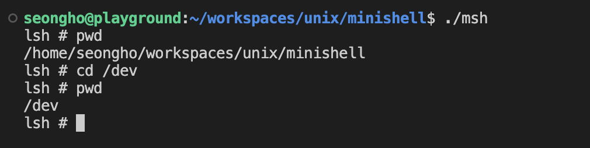

# Mini Shell 프로그램 작성 보고서
* 2019920037 컴퓨터과학부 이성호

## Tokenizer
* 기존의 `get_token` 함수의 기능을 단계벌로 추상화하여 새로운 Tokenizer를 만들었음.
* `Tokenizer` 구조체에 토큰 분리에 필요한 필드들과 다음 토큰을 가리키는 `char*` 필드를 담아 구조화 함.
```c
typedef struct Tokenizer {
    char* token;    // 현재 토큰 문자열을 가리키는 포인터
    int index;      // 현재 토큰의 인덱스
    int type;       // 현재 토큰의 종류(일반 문자, Pipe(|) 등)
    int last;       // 마지막 토큰 여부
    char* _ptr;     // (직접 접근 X) 문자열 탐색을 위해 필요한 임시 포인터
} Tokenizer;
```
### Tokenizer Usage
1. `Tokenizer` 구조체 변수를 선언하고, 토큰화할 문자열을 준비한다.
```c
Tokenizer tk;
char buffer[32];
```
2. `init_tokenizer` 함수를 호출하여 `Tokenizer` 구조체를 초기화한다. 그리고 빈 문자열이 들어와 생기는 오작동을 막기 위해 `last` 필드로 검사한다.
```c
init_tokenizer(&tk, buffer);
if (tk.last) return 0;
```
3. `get_next_token` 함수를 통해 다음 토큰을 가져온다. 이때 이 함수의 반환값은 토큰의 종류이며 `type` 필드로도 접근 가능하다. 아래의 예제는 토큰 종류가 일반적인 문자열일 때(`|`, `<`, `>` 와 같은 특수 토큰이 아닌) 명령어의 인자들을 구하는 소스코드이다.
```c
char* argv[1024];
int argc = 0;

while (get_next_token(&tk) == TOKEN_TYPE_NONE) {
    argv[argc++] = tk.token;
}
argv[argc++] = (char*)0;
```

## Mini Shell 기능 구현
* (사용자 입력) -> `interpret` -> `command` or `execute` 단계로 쉘 기능을 수행함

### 1. `cd` Command
* `cd` 기능은 외부 바이너리로 실행할 수 있는 명령어가 아니기 때문에 `command` 함수에서 직접 구현하여 해당 명령어를 수행함.
* `chdir` 함수를 사용하여 해당 작업 공간(working directory)를 변경함. 이때 인자로 경로를 줄 수 있는데 사용자로부터 입력받은 경로를 그대로 전달해준다([상대 경로인지 절대 경로인지는 중요하지 않음](https://stackoverflow.com/questions/4998530/can-chdir-accept-relative-paths)).



### 2. `type` Command

### 3. `>` Redirection

### 4. `<` Redirection

### 5. Tab Autocomplete

### 6. Pipe


어려웠던 점

토큰 분리하기
전역 변수의 남용을 막고 파싱 기능들을 적절히 분리함
Tokenizer라는 구조체 안에서 파싱에 필요한 모든 변수들을 보관하고, 쉽게 초기화할 수 있도록 함
