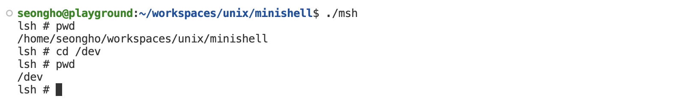

# Mini Shell 프로그램 작성 보고서
* 2019920037 컴퓨터과학부 이성호

## How To Use
* `make` 명령어를 이용해 해당 프로젝트를 컴파일한다.
* 만들어진 `msh` 바이너리를 실행하여 쉘을 사용하면 된다.

## Tokenizer
* 기존의 `get_token` 함수의 기능을 단계별로 추상화하여 새로운 Tokenizer를 만들었음.
* `Tokenizer` 구조체에 토큰 분리에 필요한 필드들과 다음 토큰을 가리키는 `char*` 필드를 담아 구조화 함.
```c
typedef struct Tokenizer {
    char* token;    // 현재 토큰 문자열을 가리키는 포인터
    int index;      // 현재 토큰의 인덱스
    int type;       // 현재 토큰의 종류(일반 문자, Pipe(|) 등)
    int last;       // 마지막 토큰 여부
    char* _ptr;     // (직접 접근 X) 문자열 탐색을 위해 필요한 임시 포인터
} Tokenizer;
```
### Tokenizer Usage
1. `Tokenizer` 구조체 변수를 선언하고, 토큰화할 문자열을 준비한다.
```c
Tokenizer tk;
char buffer[32];
```
2. `init_tokenizer` 함수를 호출하여 `Tokenizer` 구조체를 초기화한다. 그리고 빈 문자열이 들어와 생기는 오작동을 막기 위해 `last` 필드로 검사한다.
```c
init_tokenizer(&tk, buffer);
if (tk.last) return 0;
```
3. `get_next_token` 함수를 통해 다음 토큰을 가져온다. 이때 이 함수의 반환값은 토큰의 종류이며 `type` 필드로도 접근 가능하다. 아래의 예제는 토큰 종류가 일반적인 문자열일 때(`|`, `<`, `>` 와 같은 특수 토큰이 아닌) 명령어의 인자들을 구하는 소스코드이다.
```c
char* argv[1024];
int argc = 0;

while (get_next_token(&tk) == TOKEN_TYPE_NONE) {
    argv[argc++] = tk.token;
}
argv[argc++] = (char*)0;
```

## Mini Shell 기능 구현
* (사용자 입력) -> `interpret` -> `command` or `execute` 단계로 쉘 기능을 수행함

### 1. `cd` Command
* `cd` 기능은 외부 바이너리로 실행할 수 있는 명령어가 아니기 때문에 `command` 함수에서 직접 구현하여 해당 명령어를 수행함.

#### 구현 방법
* `chdir` 함수를 사용하여 해당 작업 공간(working directory)를 변경함. 이때 인자로 경로를 줄 수 있는데 사용자로부터 입력받은 경로를 그대로 전달해준다([상대 경로인지 절대 경로인지는 중요하지 않음](https://stackoverflow.com/questions/4998530/can-chdir-accept-relative-paths)).

#### 실행 결과 화면


### 2. `type` Command
* `type` 기능은 윈도우 운영체제에서 사용하는 [텍스트 파일 읽기 명령어](https://learn.microsoft.com/en-us/windows-server/administration/windows-commands/type)임
* `type` 기능 또한 `command` 함수에서 직접 구현하여 해당 명령어 수행

#### 구현 방법
* `fgets`, `fputs` 표준 파일 입출력 기능을 이용하여 해당 기능 구현

#### 실행 결과 화면


### 3. `>` Redirection
* `>` 리다이렉션은 해당 명령어의 stdout fd(file descriptor)를 특정 파일 fd로 바꾸어, stdout으로 출력된 결과가 파일로 저장되도록 하는 명령어이다.

#### 구현 방법
1. `Tokenizer`로 `>` 토큰을 확인하고 파일 이름을 구한 후 `execute` 단계에서 리다이렉션이 있음을 매개 변수로 알려준다.
2. `execute` 단계에서 `fork` 함수를 수행하여 새 프로세스를 만든 후, 리다이렉션 할 파일의 fd를 `open` 함수를 이용해 구한다. 이때 파일에 내용을 기록해야 하므로 `O_WRONLY | O_CREAT | O_TRUNC` flag를 사용한다.
3. 그 후, `dup2` 함수를 이용하여 stdout(1) fd의 내용을 위에서 구한 파일의 fd 내용으로 복제한다.

#### 실행 결과 화면


### 4. `<` Redirection
* `<` 리다이렉션은 해당 명령어의 stdin fd(file descriptor)를 특정 파일 fd로 바꾸어, 파일에 있는 내용을 해당 명령어가 읽어 수행할 수 있도록 해준다.

#### 구현 방법
1. `Tokenizer`로 `>` 토큰 왼쪽에 있는 명령어와 오른쪽에 있는 파일 이름을 구한다.
2. `execute` 단계에서 `fork` 함수를 수행하여 새 프로세스를 만든 후, 리다이렉션 할 파일의 fd를 `open` 함수를 이용해 가져온다. 이때 파일의 내용을 읽어야 하므로 `O_RDONLY` flag를 사용한다.
3. 그 후, `dup2` 함수를 이용하여 stdin fd(0)의 내용을 위에서 구한 파일의 fd 내용으로 복제한다.

#### 실행 화면


### 5. Tab Autocomplete
* Tab 키를 누르면 현재 디렉터리에 있는 파일 및 디렉터리 이름을 자동완성 해주는 기능이다.

#### 구현 방법
1. 개발 환경에서 `sudo apt install libreadline-dev`를 입력하여 `readline` 라이브러리를 설치한다.
2. 아래와 같이 기존의 사용자로 입력받는 부분을 readline 라이브러리로 바꿔준다. 
```c
#include <readline/readline.h>

int main() {
    char* buffer = "";

    while (buffer) {
        buffer = readline("lsh # ");
        if (interpret(buffer)) {
            break;
        }
        free(buffer);
    }

    return 0;
}
```
3. 컴파일 할 때 `-lreadline` 옵션을 주어 수행한다. (예: `gcc msh.c -o msh -lreadline`)

#### 실행 화면


### 6. Pipe
* `|` 좌우에 있는 명령어 사이에 스트림을 형성하는 기능이다.
* pipe 왼쪽에 있는 프로세스의 stdout이 오른쪽에 있는 프로세스의 stdin으로 연결된다.

#### 구현 방법
1. `|` 좌우에 있는 명령어를 `Tokenizer`를 이용해 파싱한다.
2. `execute` 단계에서 `fork` 함수를 수행하여 새 프로세스를 만든 후 `pipe` 함수를 이용하여 파이프 파일을 만든다.
3. 새 프로세스(부모 프로세스)에서 또 `fork` 함수를 호출하여 자식 프로세스를 만든 뒤, `dup2` 함수를 이용하여 stdout을 1번 pipe로 바꿔준다. 그리고 나서 `exec` 함수를 이용하여 왼쪽 명령어를 수행한다.
4. 부모 프로세스에서는 자식 프로세스가 종료될 때까지 기다렸다가 `dup2` 함수를 이용하여 stdin을 0번 pipe로 바꿔준다. 그리고 오른쪽 명령어를 수행한다.

#### 실행 화면

